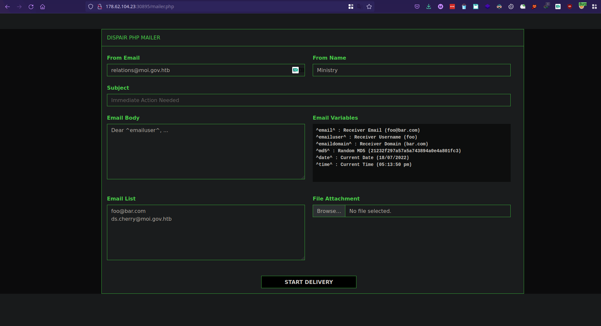
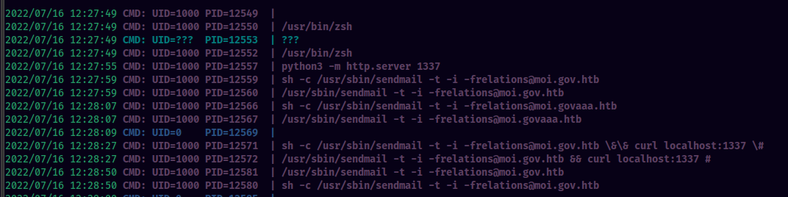

### Name: Letter Despair
#### Difficulty: Easy
#### Category: Web
Description:
> A high-profile political individual was a victim of a spear-phishing attack. The email came from a legitimate government entity in a nation we don't have jurisdiction. However, we have traced the originating mail to a government webserver. Further enumeration revealed an open directory index containing a PHP mailer script we think was used to send the email. We need access to the server to read the logs and find out the actual perpetrator. Can you help?

---
Visiting the challenge endpoint, we get a directory listing:


The `mailer.zip` contains the source code of the `mailer.php` page.


### mailer.php



At first I thought that it was some file upload vulnerability by looking at the attachment feature. But looking through the source code, it wasn't the case.
Even so, I ran the page locally with php server to see where the uploaded file is stored. Then I saw something on the server logs.


It was calling out `sendmail`. Sendmail is a CLI tool which is used to send emails. I installed sendmail and used pspy to see the command line used to run the binary.



It looks like the `From Email` parameter is directly being passed in to the shell command. This looks like an interesting injection point.
I tried performing injections with characters such as `&&`  and `;` but these were escaped properly.
I searched online and saw that there were many known exploits for PHP sendmail command injection.
I came across this one https://www.exploit-db.com/exploits/40970. Here, they were able to pass additional flag parameters onto the command using `-oQ /tmp -X/var/www/cache/phpcode.php`. It basically stores the log which contains the contents of the email and saves locally to a file at `/var/www/cache/phpcode.php`.

Simillarly, I tried with the following payload:
**From Email**:
```sh
relations@moi.gov.htb -OQueueDirectory=/tmp -X/var/www/html/cmd.php
```
**Subject**:
```php
<?php echo shell_exec($_GET['cmd']);?>
```

This will create a file at `/var/www/html/cmd.php` that will contain the php code at subject. We can then use it as a webshell to run commands on the server.


---

### Automate it

<script id="asciicast-ABKXeshfBlHoNLLBPKzE1GLgc" src="https://asciinema.org/a/ABKXeshfBlHoNLLBPKzE1GLgc.js" async></script>